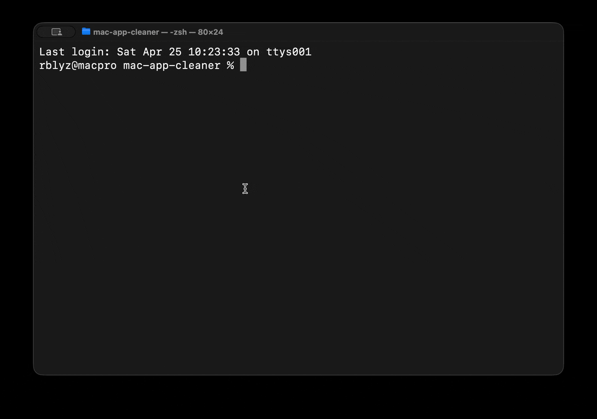

# Mac App Cleaner

Free macOS app uninstaller in pure bash. Finds leftovers, moves to Trash (not `rm`), zero dependencies. Safe. Open-source. Interactive.

> Apple still ships no real uninstaller. Drag-to-Trash leaves caches, prefs, containers, launch agents, login items — gigabytes of forgotten state. This fixes that.



## Install in 5 seconds

```bash
git clone https://github.com/rblyz/mac-app-cleaner.git && cd mac-app-cleaner && chmod +x cleaner.sh && ./cleaner.sh
```

## Or in 30 seconds

```bash
git clone https://github.com/rblyz/mac-app-cleaner.git
cd mac-app-cleaner
chmod +x cleaner.sh
./cleaner.sh
```

The first run offers to add a `cleaner` shell alias so you can launch it from anywhere.

No build, no Homebrew, no dependencies — works on stock macOS.

## How to use

1. **Run `./cleaner.sh`** — pick from the menu
2. **Browse the list** — arrow keys to move, `Space` to check multiple items, `Enter` to open or delete selected
3. **Review** — see exactly what will be moved to Trash, with sizes and a total
4. **Confirm with Y** — everything moves to `~/.Trash` via Finder. No `rm`, no `rm -rf`, nothing destroyed. Restore from Trash if you change your mind

Quit anytime with `q` or `Esc`. Nothing is touched without explicit confirmation.

## What it finds

### scan for apps

| | |
|---|---|
| **app** | Bundles in `/Applications` and `~/Applications` |
| **leftover** | Caches, prefs, containers, logs, launch agents — matched by bundle ID and app name |
| **junk** | Orphaned folders and data dirs with no installed app — group-trashable |

Leftover search covers `~/Library/{Application Support, Caches, Preferences, Containers, Group Containers, LaunchAgents, Logs, Cookies, WebKit, HTTPStorages, Application Scripts, PreferencePanes, Internet Plug-Ins, Saved Application State}`, `/Library/{LaunchAgents, LaunchDaemons, Application Support, Preferences, Caches, PrivilegedHelperTools}`, and `/private/var/db/receipts`.

Junk scan also covers `/opt/*` (Anaconda, R, and similar environments) and `/opt/homebrew/var/*` (database data directories left after formula removal).

**Multi-select**: press `Space` to check multiple apps or leftover items, then `Enter` to review and trash them all at once.

### check brew + pip packages

Read-only view of what's installed outside of `.app` bundles:

| | |
|---|---|
| **brew formulae** | Top-level packages from `brew leaves`, with disk usage including data directories |
| **brew casks** | Installed casks with real app sizes |
| **pip packages** | Python packages from `pip3 list`, with disk usage from site-packages |

Each section shows the exact command to uninstall. No deletion happens here — brew and pip don't support Trash, so we leave that to you.

## Safe by default

- **Move to Trash, never `rm`** — every action is recoverable from `~/.Trash`
- **Confirmation required** — y/N prompt before any deletion, with full file list and total size
- **Refuses to trash a running app** — in batch mode, running apps are skipped with a warning, others proceed
- **Skips system bundles** — Apple binaries, frameworks, helper extensions stay untouched
- **Precise matching** — finds files by exact bundle ID and app name, never by vendor guess

## Compatibility

- **macOS 10.15 Catalina (2019)** and newer
- **Intel** and **Apple Silicon** (M1, M2, M3, M4)
- **bash 3.2** — Apple's stock shell, present on every Mac since 2007
- **No Rosetta**, no special permissions, no admin rights
- **No Homebrew**, no installs, no network calls

## Why bash

- **Zero dependencies** — runs on any Mac, today, tomorrow, in 2030
- **bash 3.2 compatible** — works with Apple's stock shell, no installs
- **Single file, ~1200 lines** — read the source, audit it, fork it
- **No network, no telemetry** — does what it says, nothing else

## License

MIT
